# 🏠 Vacation Rental Platform - Database Schema

A robust relational database schema designed for a vacation rental platform (similar to Airbnb).
Built to handle users, property listings, complex booking logic, reviews, and financial transactions.
Designed for educational purposes.

Visual representations can be found below.

## 🛠️ Features
- **Data Integrity:** extensive use of Foreign Keys and constraints.
- **Financial Precision:** `DECIMAL` types used for all monetary transactions.
- **Security Ready:** User table structure includes `salt` fields for secure password hashing.
- **Scalable Design:** Normalized structure to avoid data redundancy.

## 📂 File Structure
- `schema.sql`: Contains the DDL (CREATE TABLE, CONSTRAINTS) to set up the database structure.
- `seed.sql`: (TO-DO) Sample data for testing purposes.

## 🚀 How to import
- Create a database named `vacation_rental_db.sql`.

## 📊 Visual representation (compact) -- See end of readme file for Mermaid

```mermaid
erDiagram
    addresses {
        int(11) addressid
        varchar(100) countryname
        varchar(10) zipcode
        varchar(100) cityname
        int(11) streetid
        varchar(10) housenumber
    }
    cities {
        varchar(100) cityname
        varchar(10) zipcode
    }
    conversations {
        int(11) conversationid
        int(11) tripid
        timestamp creationtime
    }
    conversationsmessages {
        int(11) conversationsmessageid
        int(11) conversationid
        int(11) tripid
        int(11) userid
        text message
        timestamp sendingtime
    }
    conversationsparticipants {
        int(11) conversationid
        int(11) userid
        timestamp joiningtime
    }
    countries {
        varchar(100) countryname
        varchar(5) countrycode
    }
    coupons {
        int(11) couponid
        varchar(20) couponcode
        ENUM discounttype
        DECIMAL discountvalue
        DECIMAL minimumpurchase
        DECIMAL maximumdiscount
        date startdate
        date enddate
        int(11) usagelimit
        int(11) usedcount
        varchar(255) description
    }
    emergencycontacts {
        int(11) emergencycontactid
        varchar(20) name
        varchar(20) relationship
        varchar(100) emailaddress
        varchar(5) countrycode
        varchar(20) phonenumber
        varchar(30) preferredlanguage
        int(11) userid
    }
    giftcards {
        int(11) giftcardid
        varchar(255) image_url
        DECIMAL amount
        varchar(50) recipientname
        varchar(50) recipientemail
        varchar(255) custommessage
        varchar(50) sendername
        date sendingdate
        tinyint(1) redeemed
    }
    guestsreviews {
        int(11) reviewid
        varchar(2000) reviewcontent
        int(11) hostid
        int(11) recipient_guestid
    }
    identitycards {
        int(11) identitycardid
        varchar(20) identitycardnumber
        varchar(100) countryofissue
    }
    interestscategories {
        varchar(20) interestname
    }
    languages {
        varchar(30) languagename
    }
    payments {
        int(11) paymentid
        int(11) tripid
        int(11) userid
        DECIMAL amount
        datetime paymentdate
        varchar(20) paymentmethod
        int(11) couponid
        DECIMAL coupondiscount
    }
    payouts {
        int(11) payoutid
        int(11) tripid
        int(11) userid
        DECIMAL amount
        date payoutdate
        ENUM status
    }
    placeaccessibilityoptions {
        int(11) placeaccessibilityoptionsid
        tinyint(1) accessibleparkingspot
        tinyint(1) litpathtoguestentrance
        tinyint(1) stepfreepathtoguestentrance
        tinyint(1) stepfreeguestentrance
        tinyint(1) guestentrancewiderthan32inches
        tinyint(1) swimmingpoolorhottubhoist
        tinyint(1) ceilingormobilehoist
        int(11) placeid
    }
    placeaccessibilityoptionsimages {
        int(11) placeaccessibilityoptionsimagesid
        int(11) accessibilityoption
        varchar(255) image_url
    }
    placeamenities {
        int(11) placeamenitiesid
        tinyint(1) wifi
        tinyint(1) tv
        tinyint(1) kitchen
        tinyint(1) washer
        tinyint(1) freeparking
        tinyint(1) paidparking
        tinyint(1) airconditioning
        tinyint(1) dedicatedworkspace
        tinyint(1) pool
        tinyint(1) hottub
        tinyint(1) patio
        tinyint(1) bbqgrill
        tinyint(1) outdoordiningarea
        tinyint(1) firepit
        tinyint(1) pooltable
        tinyint(1) indoorfireplace
        tinyint(1) piano
        tinyint(1) exerciseequipment
        tinyint(1) lakeaccess
        tinyint(1) beachaccess
        tinyint(1) skiinskiout
        tinyint(1) outdoorshower
        tinyint(1) smokealarm
        tinyint(1) firstaidkit
        tinyint(1) fireextinguisher
        tinyint(1) carbonmonoxidealarm
        int(11) placeid
    }
    placecheckinmethods {
        varchar(20) checkinmethod
    }
    placehighlights {
        int(11) placehighlightsid
        tinyint(1) rare
        tinyint(1) rustic
        tinyint(1) innature
        tinyint(1) memorable
        tinyint(1) romantic
        tinyint(1) historic
        int(11) placeid
    }
    placerules {
        int(11) placerulesid
        int(11) numberofpetsallowed
        int(11) eventsallowed
        int(11) smokingallowed
        int(11) quiethours
        time quiethoursbegin
        time quiethoursend
        varchar(2000) additionalrules
        int(11) placeid
    }
    places {
        int(11) placeid
        int(11) hostid
        varchar(20) categoryname
        varchar(12) placetype
        DECIMAL latitude
        DECIMAL longitude
        varchar(32) title
        varchar(500) description
        tinyint(1) automaticbookingapproval
        tinyint(1) soldout
        DECIMAL pricepernight
        datetime checkintime
        datetime checkouttime
        varchar(2000) directions
        varchar(20) checkinmethod
        varchar(2000) checkininstructions
        varchar(30) wifinetworkname
        varchar(30) wifipassword
        varchar(2000) housemanual
        varchar(2000) checkoutinstructions
    }
    placescategories {
        varchar(20) categoryname
        varchar(255) icon_url
    }
    placesreviews {
        int(11) reviewid
        varchar(2000) reviewcontent
        int(11) userid
        int(11) tripid
    }
    placestypes {
        varchar(12) typename
        varchar(20) categoryname
    }
    placestypesnames {
        varchar(12) typename
    }
    placesunavailabledates {
        date notavailabledate
        int(11) placeid
    }
    redeemedgiftcards {
        int(11) giftcardid
        int(11) userid
    }
    streets {
        int(11) streetid
        varchar(100) streetname
        varchar(100) cityname
    }
    trips {
        int(11) tripid
        int(11) placeid
        int(11) numberofparticipants
        date checkindate
        date checkoutdate
    }
    tripsparticipants {
        int(11) tripsparticipantid
        int(11) tripid
        int(11) userid
    }
    users {
        int(11) userid
        tinyint(1) ishost
        varchar(50) fullname
        varchar(20) preferredname
        varchar(100) emailaddress
        varchar(255) password
        varchar(32) salt
        varchar(5) countrycode
        varchar(20) phonenumber
        int(11) addressid
        int(11) identitycardid
        varchar(450) intro
        varchar(20) work
        varchar(40) attendedschool
        tinyint(1) showbirthdecade
        tinyint(1) showvisitedplaces
        varchar(40) favouritehighschoolsong
        varchar(40) obsessions
        varchar(40) funfact
        varchar(40) mostuselessskill
        varchar(40) bibliographytitle
        varchar(40) excessivetimespenton
        varchar(40) pets
        varchar(255) profilepicture_url
        DECIMAL balance
    }
    usersinterests {
        int(11) userinterestid
        int(11) userid
        varchar(20) interestname
    }
    userslanguages {
        int(11) userlanguageid
        int(11) userid
        varchar(20) languagename
    }
    wishlistsitems {
        int(11) wishlistitemid
        int(11) placeid
        int(11) wishlistid
    }
    wishlistsnames {
        int(11) wishlistid
        int(11) wishlistname
        int(11) userid
    }
    zipcodes {
        varchar(10) zipcode
        varchar(100) countryname
    }
    
    %% Users relationships
    users ||--o{ places : "hosts"
    users ||--|| addresses : "has"
    users ||--|| identitycards : "has"
    users ||--o{ emergencycontacts : "has"
    users ||--o{ usersinterests : "has"
    users ||--o{ userslanguages : "speaks"
    users ||--o{ wishlistsnames : "creates"
    users ||--o{ conversationsparticipants : "participates"
    users ||--o{ conversationsmessages : "sends"
    users ||--o{ tripsparticipants : "joins"
    users ||--o{ payments : "makes"
    users ||--o{ payouts : "receives"
    users ||--o{ placesreviews : "writes"
    users ||--o{ guestsreviews : "receives_as_guest"
    users ||--o{ guestsreviews : "writes_as_host"
    users ||--o{ redeemedgiftcards : "redeems"
    
    %% Address relationships
    addresses ||--|| countries : "located_in"
    addresses ||--|| zipcodes : "has"
    addresses ||--|| cities : "in"
    addresses ||--|| streets : "on"
    
    %% Geographic relationships
    countries ||--o{ zipcodes : "contains"
    countries ||--o{ identitycards : "issues"
    countries ||--o{ emergencycontacts : "country_code"
    zipcodes ||--o{ cities : "identifies"
    cities ||--o{ streets : "contains"
    
    %% Identity and emergency contacts
    identitycards ||--|| countries : "issued_by"
    emergencycontacts ||--|| languages : "prefers"
    emergencycontacts ||--|| countries : "country_code"
    
    %% Languages and interests
    languages ||--o{ userslanguages : "spoken_by"
    interestscategories ||--o{ usersinterests : "interested_by"
    
    %% Places relationships
    places ||--|| placescategories : "belongs_to"
    places ||--|| placestypesnames : "is_type"
    places ||--|| placecheckinmethods : "uses"
    places ||--o| placeamenities : "has"
    places ||--o| placeaccessibilityoptions : "has"
    places ||--o| placehighlights : "has"
    places ||--o| placerules : "has"
    places ||--o{ placesunavailabledates : "unavailable_on"
    places ||--o{ trips : "booked_in"
    places ||--o{ wishlistsitems : "wishlisted_in"
    
    %% Place categories and types
    placescategories ||--o{ placestypes : "has"
    placestypesnames ||--o{ placestypes : "categorized_in"
    
    %% Place accessibility
    placeaccessibilityoptions ||--o{ placeaccessibilityoptionsimages : "has_images"
    
    %% Trips relationships
    trips ||--o| conversations : "has"
    trips ||--o{ conversationsmessages : "contains_messages"
    trips ||--o{ tripsparticipants : "has_participants"
    trips ||--o| payments : "has_payment"
    trips ||--o| payouts : "has_payout"
    trips ||--o| placesreviews : "reviewed_in"
    
    %% Conversations relationships
    conversations ||--o{ conversationsparticipants : "has_participants"
    conversations ||--o{ conversationsmessages : "contains"
    
    %% Wishlists relationships
    wishlistsnames ||--o{ wishlistsitems : "contains"
    
    %% Coupons and payments
    coupons ||--o{ payments : "used_in"
    
    %% Gift cards
    giftcards ||--o{ redeemedgiftcards : "redeemed_by"
```

🔻 CLICK HERE FOR MERMAID 🔻

